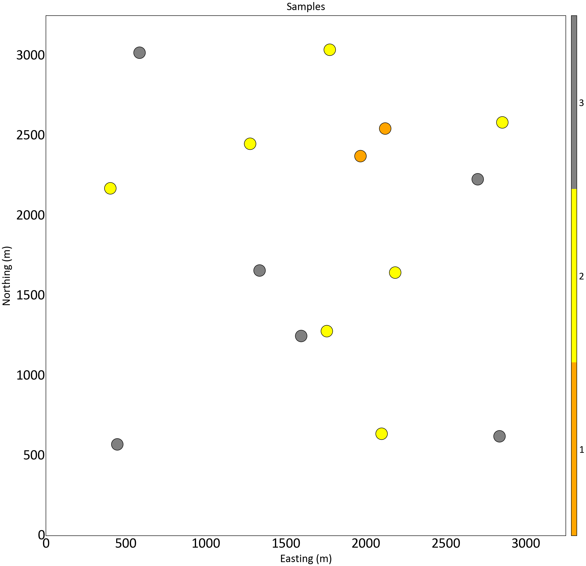
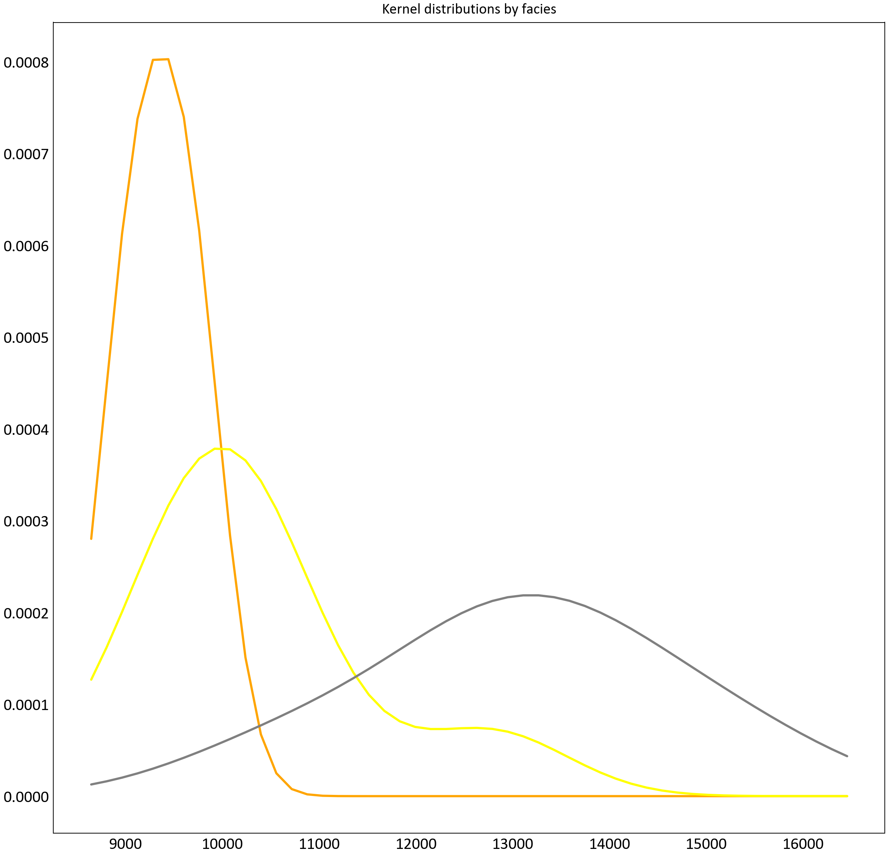

# Sequential Indicator Simulation: Method and Example Application

This repository contains the code and data for an example application of the Sequential Indicator Simulation (SIS) method, as outlined in the geostatistical lesson available at [Geostatistics Lessons](https://geostatisticslessons.com/lessons/sequentialindicatorsim).

## Samples

    

**Figure 1:** Location map with the sampled points.

## KDE Distributions

    

**Figure 2:** Modeled kernel distribution of acoustic impedance for each facies.

## Contact

For any questions or suggestions, please reach out to Thiago A Mizuno at [thiagomizuno@gmail.com](mailto:thiagomizuno@gmail.com).

## References

[1] Mizuno, T., & Deutsch, C. (2022). Sequential Indicator Simulation (SIS). In J.L. Deutsch (Ed.), Geostatistics Lessons. Retrieved from http://www.geostatisticslessons.com/lessons/sequentialindicatorsim
